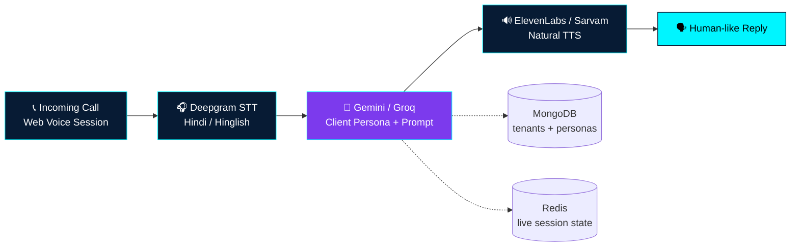

<div align="center">


<br>

<a href="https://github.com/KhushalYadav535"></a>
<a href="https://github.com/KhushalYadav535?tab=followers"></a>


</div>

<div align="center">

> ### *“People don't remember code. They remember the impact it created.”*
> **Build. Learn. Share. Repeat. — from Prayagraj to the world. 🇮🇳**

</div>

---

## 🧬 About — `whoami`

```typescript
const khushal = {
  name: "Khushal Yadav",
  role: "AI Engineer & Technical Founder",
  base: "Prayagraj, India",
  work: "Sentient Digital, Indore",
  education: "B.Tech CSE — BBDNITM, Lucknow",
  flagship: "Vaani AI — multi-tenant Hindi/Hinglish voice agent platform",
  stack: ["React", "Node.js", "Python", "MongoDB", "Redis", "Docker", "Traefik"],
  voice: ["Deepgram STT", "Gemini / Groq LLM", "ElevenLabs / Sarvam TTS"],
  mantra: "Coffee → Code → Deploy → Repeat",
  status: "Open to interesting opportunities"
};
```

| 🌍 Location | 💼 Role | 🎓 Education | 🎙️ Flagship | 📦 Repos | 🗣️ Languages |
|---|---|---|---|---|---|
| Prayagraj, UP | AI Engineer @ Sentient Digital | B.Tech CSE | **Vaani AI** | 110+ public | Hindi, English |

- 🎙️ Building **Vaani AI** — Hindi/Hinglish voice agents for support & sales automation
- 🛠️ Solo full-stack: architecture → code → Docker + Traefik + Coolify on VPS
- 🧠 Obsessed with low-latency STT → LLM → TTS pipelines & per-call cost optimization
- 📈 1000+ commits, 110+ repos, shipping every week

---


<div align="center">

**Frontend**
<br>


**Backend**
<br>


**Data**
<br>


**AI / CV**
<br>


**DevOps**
<br>


<br>


</div>

---


<div align="center">

| 🎙️ **Vaani AI** — India's multilingual Voice AI platform |
|---|
| Multi-tenant voice agents in **Hindi / Hinglish** for support & sales. Real-time **STT → LLM reasoning → natural TTS** in one low-latency pipeline. Each client gets its own persona, system prompt & voice — one shared infra for cost efficiency. |
| ✔ Hindi grammatical-gender agreement fix &nbsp;•&nbsp; ✔ TTS cost cut with quality intact &nbsp;•&nbsp; ✔ Redis sessions + MongoDB tenants |
| `Node.js` `WebSockets` `Deepgram` `Gemini/Groq` `ElevenLabs/Sarvam` `MongoDB` `Redis` `Docker` `Traefik` |

</div>

### 📌 Bento Grid

| 🍕 **Gaon Zaika**<br><sub>Swad Gaon Ka — full food-delivery ecosystem</sub><br><br>Customer app + restaurant panel + live tracking + admin. Shipped solo, cleared Play Console Data-Safety rounds.<br><br>`React Native` `Expo` `Node.js` `MongoDB` | 🏢 **AapkiSociety**<br><sub>Society management, simplified</sub><br><br>Mobile app + backend for residential communities — complaints, notices, billing, day-to-day ops.<br><br>`React Native` `Node.js` |
|---|---|
| 📈 **Avadh15 / Tradebackend**<br><sub>Practice trading, real security</sub><br><br>Virtual trading simulator + hardened auth & portfolio layer over live sockets.<br><br>`Node.js` `WebSockets` `Redis` | 🌾 **TextMitra**<br><sub>Hindi + English document intelligence</sub><br><br>OCR backend for scans, invoices & forms with high-accuracy extraction.<br><br>`Python` `Flask` `PaddleOCR` |
| ☁️ **VPS Infra — one pattern, every product**<br><sub>Docker → Traefik → Coolify → Let's Encrypt on Linux. Every project above runs on this.</sub><br>`Docker` `Traefik` `Coolify` `Linux` | 🚀 **Next Target: 10M users**<br><sub>Scaling Vaani AI latency ↓ cost ↓ clients ↑</sub><br>Want Hindi voice AI for your business? Let's talk ↓ |

<div align="center">


<br>


<sub>↑ Update repo names to match your exact GitHub repo names if any card shows 404.</sub>

</div>

---




---


<div align="center">


</div>

---


<div align="center">

<picture>
  <source media="(prefers-color-scheme: dark)" srcset="https://raw.githubusercontent.com/KhushalYadav535/KhushalYadav535/output/github-contribution-grid-snake-dark.svg">
  <source media="(prefers-color-scheme: light)" srcset="https://raw.githubusercontent.com/KhushalYadav535/KhushalYadav535/output/github-contribution-grid-snake.svg">
  
</picture>

<sub>Auto-updated by <a href="https://github.com/Platane/snk">Platane/snk</a> GitHub Action — needs <code>.github/workflows/snake.yml</code> in your profile repo.</sub>

</div>

---


```text
2023 ─── Learning Programming
          │  HTML, CSS, JavaScript fundamentals
          ▼
2024 ─── Frontend + Backend
          │  React, Node.js, MongoDB
          ▼
2025 ─── Full Stack Engineer
          │  Production apps, Docker, VPS deployment
          ▼
2026 ─── AI Engineer @ Sentient Digital
          │  Voice AI, LLM integration, multi-tenant SaaS
          │  Shipping Vaani AI 🚀
          ▼
Next ─── Founder — scaling AI products to millions
```

```yaml
Mission Log:
  ✔ 1000+ commits | 110+ repos
  ✔ Vaani AI — multi-tenant voice platform
  ✔ Gaon Zaika — food delivery startup
  ✔ AapkiSociety — society management
  ✔ Avadh15 — trading simulator
  ✔ TextMitra — Hindi/English OCR SaaS
  ✔ Self-hosted Docker + Traefik + Coolify infra
  Next: 10 Million Users
```

```yaml
Daily Loop:
  Morning:   review prod, fix overnight alerts
  Afternoon: ship features, client testing
  Evening:   research LLMs / voice / DevOps
  Night:     deploy + learn something new
  Loop:      IDEA → PLAN → CODE → TEST → DEPLOY → SCALE → ∞
```

<details>
<summary><b>❓ What are you focused on right now?</b></summary>
<br>
Scaling Vaani AI — lower latency, lower per-call cost, more clients on the multi-tenant platform.
</details>

<details>
<summary><b>❓ Go-to stack for a new product?</b></summary>
<br>
React / React Native + Node.js/Express + MongoDB/Postgres, Dockerized behind Traefik via Coolify. Python (Flask/FastAPI) for AI/OCR services.
</details>

<details>
<summary><b>❓ Open to work / collab?</b></summary>
<br>
Yes — Voice AI, SaaS, automation. Email or LinkedIn below. Hindi & English both OK.
</details>

---


<div align="center">

<a href="https://github.com/KhushalYadav535"></a>
<a href="https://www.linkedin.com/in/khushal-yadav-27a178220"></a>
<a href="mailto:khushalyadavofficial@gmail.com"></a>
<a href="https://leetcode.com"></a>

### ⭐ Follow me — new voice-AI builds drop every week.


</div>
